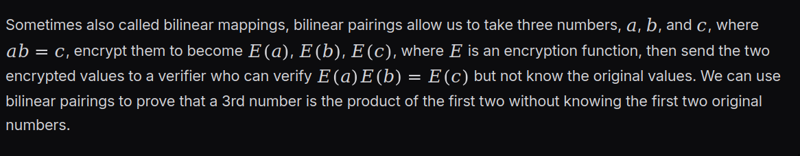
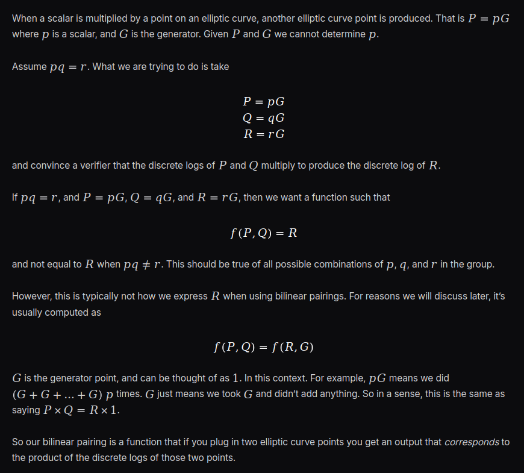
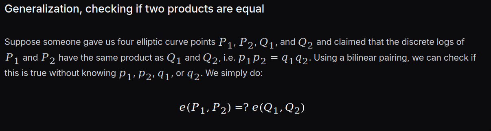
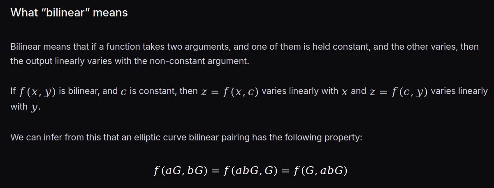
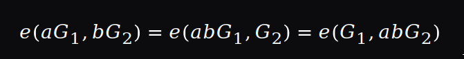

## How bilinear pairings work

i was learning about bilinear pairings from the rareskills zk book, and in my initial read of the chapter i had so many questions because i didn't understand due to my low iq, so i listed them and then went through them, at first i will share the questions and then talk about what i understood after. (the screenshots are from the book)

Here is the link of the book: https://rareskills.io/post/bilinear-pairing#end-to-end-solidity-example-of-bilinear-pairings

here they said that the pairing allows us to prove that a number is the product of 2 other numbers without ever leaking the numbers, is this the only use case ? i don't know

and they said it allows us encrypt them and then they do the computation on the encrypted values, the pairing allow us to do what exactly here ? the encryption is the thing that the pairing gives us ? or what

for me i think the pairing is the notation of the multiplication of E(a) with E(b)

from this what i understand is : 

a `bilinear pairing` is a function that takes 2 elliptic curve points as input and returns an output that corresponds to the product of the `dl` of the points

now they are limiting the pairing to elliptic curves only ?

if we stick to the definition they gave us, this is clear, the function `e` just checks the `dl` product

now this is again confusing me, because they are giving a general definition to the `bilinear` mapping

they are saying that it simply a function that if we fix one argument and the other varies, it gives us a linear function

but then they jump into that property, i have no idea where it did come from

and then the book stops explaining how this property did come from!! i am really confused is the problem with me ??

1- is the mapping a function that works only with elliptic curves and gives the product of the `dl` ? 

2- is it a more general function that allows us to prove that a*b = c from E(a)*E(b) = E(c) ??

3- or it is a more more general function that comes from linear functions

**AFTER DARK**

so after fighting with my stupid questions, i was able to find a quite of understanding that made sense for me

1-  what a bilinear function is

In its simplest form, a bilinear function is a function that takes 2 arguments where if you fix one and the other varies, the output will vary with that input that is not fixed

so it is a function *f : A X B -> C* where f(a,b) = c, if we fix `a`

b and c will vary in the same way (meaning they scale together, if we multiply b by 2, c will scale by 2 also, and so on)

for example f(x,y) = 5*x*y, if we fix x or y, lets say we set y = 2, it will become a linear function `f(x) = 10x`

i know this may sound stupid, but lets talk about linear functions :

a linear function is a function that the input and output behaves in the same way when working with either addition or multiplication, so it preserves the structure of these 2 operations, and that is way we always define a linear function with 2 properties :

1 - `f(x+y) = f(x) + f(y)`

2 - `f(k*x) = kf(x)`

and from these, we can conclude that bilinear function also have these 2 properties

2 - bilinear functions in the context of cryptography

here the headaches may start, but hopefully it is simple if we look at it from a good angle

we talked about bilinear functions before, right? cool. Now when we take the same exact function and write *f : G1 X G2 -> Gt* where :

* G1,G2 are 2 elliptic curve groups (they can be same or different but same order)
* Gt is not an elliptic curve group, probably all you need to know about is that it is a finite cyclic group, but i will add some details later

we can absolutely do that because we didn't restrict what group elements the function f takes 

now with this f function that works with elliptic curves, our goal is to achieve :

for `P = p*G` and `Q = p*Q` and `R = r*R`, we prove that we know `p*q = r` without ever leaking their values, only by using the the public points P,Q,R

and there is bilinear mapping that allows us to do that :

**f(P,Q) = f(R,G)**

and we call it a bilinear pairing 

NOTE : we use the word "pairing" in the context of elliptic curves only

so a bilinear pairing is a function that corresponds to the product of the discrete log of the arguments, which are the points

now where did this come from ? 

lets talk a bit more about `Gt`

`Gt` is a subgroup of the multiplicative group of a finite field extension

as we know a finite field `Fp` is composed from 2 groups, one under addition and the other under multiplication excluding 0, an extension of the field can be `Fp^12`, so we work with elements of dimension 12 instead of 1 dimension elements following some rules

and the multiplicative group of the field is simply the group that is working with multiplication

and by subgroup we simply take less elements of the whole group, but a subgroup is still considered a group by itself

so `Gt` works with elements under multiplication, Cool!

now if we take this pairing : `f(k*A,B)`, what we can do with it ?

remember that the pairing is a linear function when we fix one argument !

so if we fix B = H1 we get f(k*A,H1) and this is linear function, and using the addition property we get : `f(k*A,H1) = f(A,H1) * f(A,H1) *** k times`, and an abbreviation for multiplication is `f(A,H1)^k` 

now we do the same thing for `B=H2` and `B=H3` and so on, we notice that it is true for every point we set B to, so we can directly say `f(k*A,B) = f(A,B)^k`

from this, all properties are easier to understand

for example in the book :

they can all be written : `e(G1,G2) ^ (a*b)`

why is Gt really complex? well remember that the pairing is a function, if takes inputs and gives output, we need it to satisfy the properties of linear function, so Gt is probably the group that satisfies it.

hopefully from my perspective, what i have written here answers my questions, remember that i am just a beginner in this field, so don't take it as official resource to work on, instead my goal is to have people that review it and help me improve my tagging mistakes i did

And from now, i will be showing my POC of this book chapter because i liked it so i read it 

## Bilinear Pairings in Ethereum

### precompiles

when we are working with a programming language that produces `evm` bytecode, for example solidity, if the function we did implement in solidity was complicated, it will produce so many opcodes to store and the `evm` interpreter will execute each opcode one by one, that will cost gas, so complicated logic can lead to consuming so much gas

when talking about a pairing function, it is actually really really complicated,the codomain group elements have a dimension of 12, and when we are restricted to the native opcodes of the evm that can only work with 256 bits words, we will need so many opcodes to work with the Gt elements, so if we implement it using solidity directly (meaning in the smart contract we write all the logic) it will produce a very big amount of opcodes and this can lead to problems like hitting the maximum size of the block

for this reason `ethereum precompiles` exist, what they do is basically when we call `pairing` in solidity, it will not produce bytecode that correspond to the logic of the `pairing`, instead it produces a call opcode, specifically `CALL 0X8`, and then the `evm` will execute the pairing logic

as we know, depending and what client we are running, the `evm` will use a certain programming language, for example if we were using `geth`, then all the `evm` logic is implemented using go, for example the `ADD` opcode is implemented using go, so when hitting the `CALL 0x8` opcode, we will be running the pairing logic using go, a language like go running on the cpu can perform much more efficiently

and the `0x8 precompile` follows the `EIP 197 Specification`, which tell the `evm implementation` we are running what to do exactly when hitting that `0x8` call, like how much gas it most cost, what to return, the format, the groups we should use, and pretty much everything, you can find it here https://eips.ethereum.org/EIPS/eip-197

`PyEVM` is a python implementation of the `EVM` specification, but there is no running client with this implementation participating in the `ethereum` network, because `PyEVM` was built mainly for testing and research, the project is now archived and you can find it here https://github.com/ethereum/py-evm

previously in this chapter, we worked with the `py_ecc` library, this library is actually the code that is implemented for the `0x8 precompile` in the `PyEVM`
